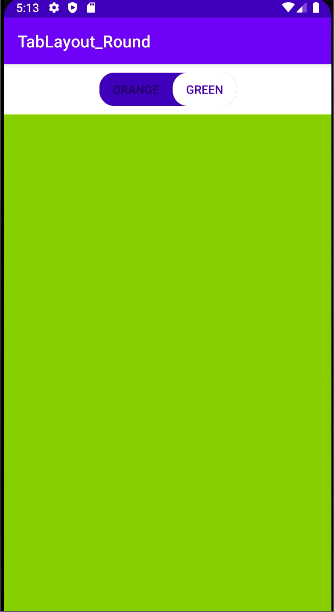

### TabLayout _ Round Tab

탭 레이아웃 꾸미기 (둥근 버튼 처럼 만들어보기)

###### 참고 [Android: TabLayout Tabs with rounded corners](https://medium.com/@kuldar.daniel/android-tablayout-tabs-with-rounded-corners-e14169b0df59)

✔️**기본 탭 레이아웃과 만드는 방식 1️⃣ ~ 7️⃣ 모두 동일!**

➡️ [TabLayout_Basic 만드는 방법 보기](https://github.com/yunakim2/android_template/blob/master/TabLayout_basic/TabLayout_basic.md)

➡️ **drawable 폴더에 tablayout.xml(tablayout_background)추가 해주기**

 ~~~xml
<?xml version="1.0" encoding="utf-8"?>
<shape xmlns:android="http://schemas.android.com/apk/res/android" android:shape="rectangle">
    <corners android:radius="18dp"/>
    <solid android:color="@color/colorPrimaryDark"/>
</shape>

 ~~~

➡️ **drawable 폴더에 selected_tab.xml(선택되어진 tab_background)추가 해주기**

 ~~~xml
<?xml version="1.0" encoding="utf-8"?>
<shape xmlns:android="http://schemas.android.com/apk/res/android" android:shape="rectangle">
    <corners android:radius="18dp"/>
    <solid android:color="#ffffff"/>
</shape>

 ~~~

➡️ **drawable 폴더에 unselected_tab.xml(선택 되지 않았을 때 tab_background)추가 해주기**

 ~~~xml
<?xml version="1.0" encoding="utf-8"?>
<shape xmlns:android="http://schemas.android.com/apk/res/android" android:shape="rectangle">
    <solid android:color="@android:color/transparent"/>
</shape>
 ~~~

➡️ **drawable 폴더에 tab_layout_selector(앞에서 만든 xml 연결해주기)추가 해주기**

 ~~~xml
<?xml version="1.0" encoding="utf-8"?>
<selector xmlns:android="http://schemas.android.com/apk/res/android">

    <item
        android:drawable="@drawable/selected_tab"
        android:state_selected="true"/>
    <item
        android:drawable="@drawable/tablayout"
        android:state_selected="false"/>
</selector>
 ~~~

➡️ **activity_main.xml TabLayout 부분 수정하기**

 ~~~xml
 <com.google.android.material.tabs.TabLayout
        android:layout_width="wrap_content"
        android:layout_height="40dp"
        android:layout_marginTop="10dp"
        android:id="@+id/Tab"
        android:background="@drawable/tablayout"
        app:tabMode="scrollable"
        app:tabBackground="@drawable/tab_layout_selector"
        app:tabSelectedTextColor="@color/colorPrimaryDark"
        app:tabPaddingStart="16dp"
        app:tabPaddingEnd="16dp"
        app:tabIndicatorHeight="0dp"
        app:layout_constraintTop_toTopOf="parent"
        app:layout_constraintLeft_toLeftOf="parent"
        app:layout_constraintRight_toRightOf="parent"/>
 ~~~

✔️ 같이 보면 좋을 것 
###### [Dot Tabitem](https://itnext.io/4-steps-to-android-dot-tabitem-dadeeef44f51)

