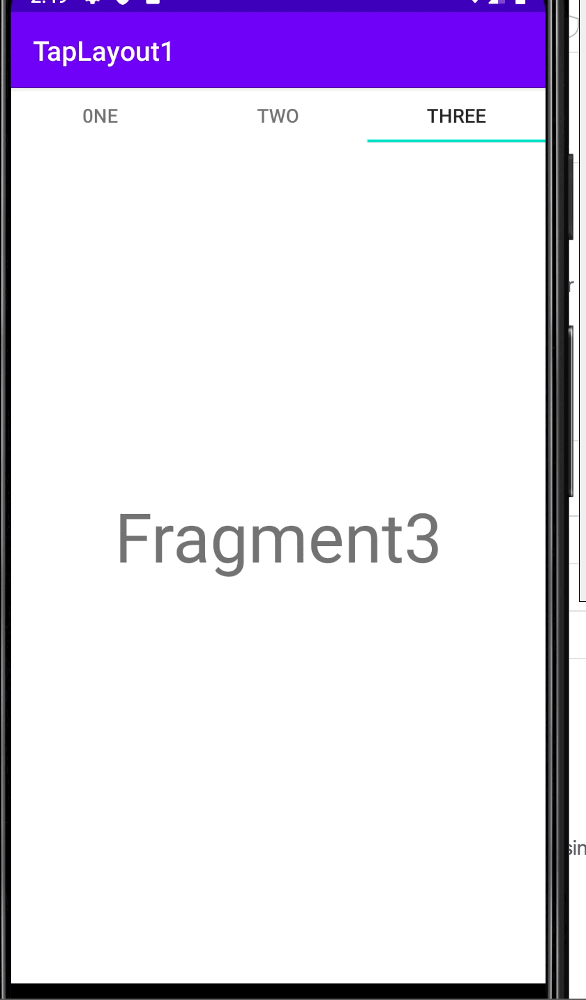
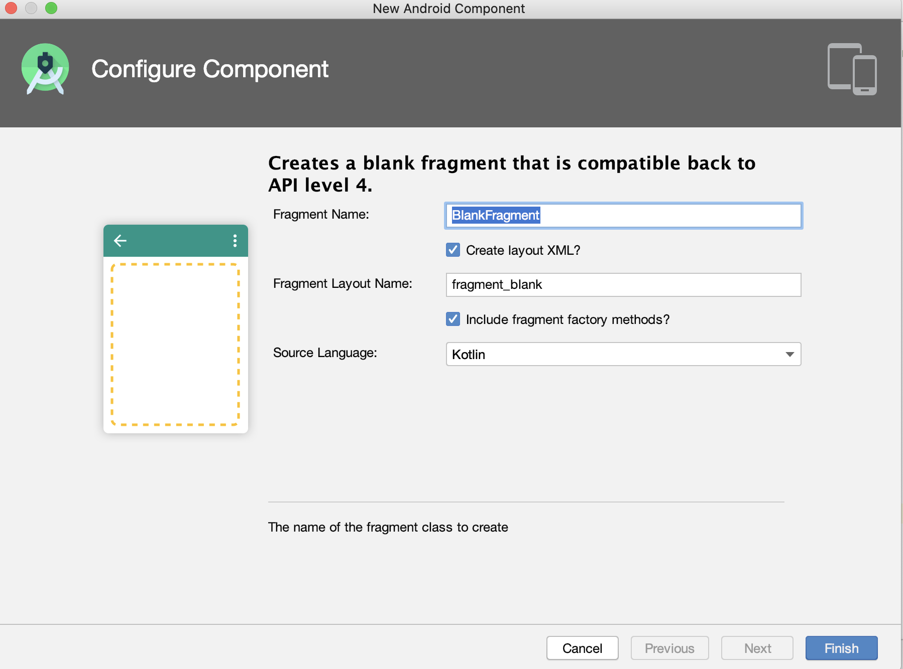

## TabLayout_Basic

기본 탭 레이아웃 만들어보기 (Fragment 3개를 이용하여 ViewPager 만들기)

 

 

1️⃣ **Gradle에 implementation 'com.google.android.material:material:1.0.0' 추가하기 **

(TabLayout 과 ViewPager 사용하기 위해)

~~~kotlin
dependencies {
   	
    implementation 'com.google.android.material:material:1.0.0'
    
}
~~~

 

2️⃣ **activity_main.xml 파일에 TabLayout과 ViewPager 추가하기 **

~~~kotlin
 <com.google.android.material.tabs.TabLayout
        android:id="@+id/tab"
        android:layout_width="match_parent"
        android:layout_height="40dp"
        android:background="#ffffff"
        app:layout_constraintTop_toTopOf="parent"
        app:layout_constraintLeft_toLeftOf="parent"
        app:layout_constraintRight_toRightOf="parent"/>

    <androidx.viewpager.widget.ViewPager
        android:layout_width="match_parent"
        android:layout_height="match_parent"
        android:id="@+id/viewPager"
        app:layout_constraintTop_toBottomOf="@id/tab"
        app:layout_constraintLeft_toLeftOf="parent"
        app:layout_constraintRight_toRightOf="parent"/>
~~~

 

3️⃣**Fragment 추가해주기 ✔️ fragmentfactorymethods 추가 XXX **

(tab1Fragment, tab2Fragment, tab3Fragment 생성)

 

4️⃣ **Fragment를 보기 편하게 하기위해 임의로 fragment_tab1.xml에 TextView 배치하기**

(fragment_tab2.xml, fragment_tab3.xml 동일)

~~~kotlin
 <TextView
        android:layout_width="match_parent"
        android:layout_height="match_parent"
        android:text="Fragment1"
        android:textSize="50dp"
        android:layout_gravity="center"
        android:gravity="center"/>
~~~

 

5️⃣ **Fragment.kt 마다 newInstant() 함수 만들어주기 **

(tab2Fragment.kt, tab3Fragment.kt 동일 )

~~~kotlin
fun newInstant() : tab1Fragment
    {
        val args = Bundle()
        val frag = tab1Fragment()
        frag.arguments = args
        return frag
    }
~~~

 

6️⃣ **FragmentAdapter class 만들어주기**

~~~kotlin
class FragmentAdapter (fm : FragmentManager): FragmentPagerAdapter(fm) {
  //position 에 따라 원하는 Fragment로 이동시키기  
  override fun getItem(position: Int): Fragment {
       val fragment =  when(position)
       {
           0->tab1Fragment().newInstant()
           1-> tab2Fragment().newInstant()
           2-> tab3Fragment().newInstant()
           else -> tab1Fragment().newInstant()
       }
        return fragment
    }

  //tab의 개수만큼 return
    override fun getCount(): Int = 3

  //tab의 이름 fragment마다 바꾸게 하기
    override fun getPageTitle(position: Int): CharSequence? {
        val title = when(position)
        {
            0->"0ne"
            1->"Two"
            2->"Three"
            else -> "main"
        }
        return title     }
}
~~~

 

- getCount(int) : 총 몇 개의 화면을 구성할 지 지정
- getItem(int) : 순서(position)에 따른 화면 지정
- getPageTitle(int) : Tab의 제목 지정

 

***kotlin 문법(switch ~ case 문)***

- Java (switch ~ case문) 사용법

~~~java
switch(i)
{
  case 1 : "1"; 
  case 2 : "2";
  case 3 : "3";
  default : "else";
  
}
~~~

- kotlin (when문)

~~~kotlin
when(i)
{
  0->"1"
  1->"2"
  2->"3"
  else -> "else"
}
~~~

 

7️⃣ **MainActivity.kt 에 pager와 tab 연결해주기**

~~~ kotlin
	 val pagerAdapter = FragmentAdapter(supportFragmentManager)
   val pager = findViewById<ViewPager>(R.id.viewPager)
   pager.adapter = pagerAdapter
   val tab = findViewById<TabLayout>(R.id.tab)
   tab.setupWithViewPager(pager)
~~~

 

 